# 🚀 Salesforce Metadata Transpiler

A class-based transpiler that converts **JSON schema definitions** into **Salesforce deployment-ready XML packages (.zip)**.
It validates schema inputs, generates XML for custom objects and fields, organizes them into the correct folder structure, and creates a deployable package.

---

## 📝 Quick Example

```ts
import { SalesforceMetadataTranspiler } from './src/transpiler';
import fs from 'fs';

// Load JSON schema
const jsonSchema = JSON.parse(fs.readFileSync('docs/json-schema-example.json', 'utf-8'));

// Initialize transpiler
const transpiler = new SalesforceMetadataTranspiler({ apiVersion: '61.0' });

// Run transpilation
const result = await transpiler.transpile(jsonSchema);

if (result.success) {
    console.log(`🎉 Deployment package created: ${result.zipPath}`);
} else {
    console.error('❌ Transpilation failed:', result.errors);
}
```

## JSON Schema Shape

Your JSON input consists of a **top-level object** describing the type of metadata and a `metaData` array containing individual metadata items. Here's the conceptual structure:

* **type**: The kind of metadata you are deploying (e.g., `CustomObject`).
* **metaData**: An array of metadata items. Each item represents an object or entity and contains:

  * **label**: Human-readable singular name.
  * **pluralLabel**: Human-readable plural name.
  * **description**: A short description of what the object represents.
  * **deploymentStatus**: Deployment state (usually `Deployed`).
  * **allowInChatterGroups**: Boolean flag.
  * **nameField**: Object defining the primary name field with `label`, `type`, and `trackHistory`.
  * **enableActivities / enableBulkApi / enableFeeds / enableHistory / enableLicensing / enableReports / enableSearch / enableSharing / enableStreamingApi**: Boolean flags for object features.
  * **visibility**: Visibility of the object (e.g., `Public`).
  * **fields**: An array of field definitions. Each field has:

    * **type**: Field type (e.g., `AutoNumber`, `Formula`, `Text`).
    * **label**: Human-readable label.
    * **fullName**: Salesforce API name.
    * Additional properties depending on the type (e.g., `displayFormat` for AutoNumber, `formula` for Formula, `startingNumber`, `helpText`, etc.).

> This is the **shape**: top-level `type`, followed by an array of `metaData` objects, each containing metadata-specific properties and a `fields` array.

## Example JSON Input

```typescript
{
  type: "CustomObject",
  metaData: [
    {
      label: "Asset",
      pluralLabel: "Assets",
      description: "Represents a company asset used for tracking inventory and lifecycle status.",
      deploymentStatus: "Deployed",
      allowInChatterGroups: true,
      nameField: { label: "Asset Name", type: "Text", trackHistory: false },
      enableActivities: true,
      enableBulkApi: true,
      enableFeeds: false,
      enableHistory: true,
      enableLicensing: false,
      enableReports: true,
      enableSearch: true,
      enableSharing: true,
      enableStreamingApi: true,
      visibility: "Public",
      fields: [
        {
          type: "AutoNumber",
          label: "Asset ID",
          fullName: "Asset_ID__c",
          displayFormat: "ASSET-{YYYY}-{0000}",
          description: "Automatically generated identifier for each asset record.",
          helpText: "Example: ASSET-2026-0001",
          startingNumber: 1
        },
        {
          type: "Formula",
          label: "Asset Status Label",
          fullName: "Asset_Status_Label__c",
          returnType: "Text",
          formula: 'IF(NOT(ISBLANK(Asset_ID__c)), "ACTIVE: " & Name, "INACTIVE")',
          blankOption: "BlankAsZero",
          description: "Human-readable status based on assigned ID.",
          helpText: "Shows ACTIVE or INACTIVE followed by the record name."
        }
      ]
    }
  ]
}
```

## ✨ Key Features

* ✅ Multi-level JSON schema validation using **Zod**
* ✅ Automatic XML generation for custom objects & fields
* ✅ Organized folder structure compatible with Salesforce
* ✅ Creates `package.xml` and ZIP deployment packages
* ✅ Extensible for **custom fields** and **validators**

---

## 🧐 Why This Exists

* Accelerates Salesforce metadata development
* Reduces human errors in XML generation
* Ensures consistent naming conventions and org-level rules
* Provides a **maintainable and reusable codebase**

---

## 🏗️ High-Level Architecture

```mermaid
flowchart TD
    A["JSON Input"] --> B["SchemaValidator 🛡️"]
    B --> C["XMLGenerator 📄"]
    C --> D["FileSystemGenerator 📁"]
    D --> E["PackageBuilder 📦"]
    E --> F["Deployment Package .zip 🎯"]
```



*See [docs/Architecture.md](docs/Architecture.md) for detailed architecture.*

---

## ⚡ Getting Started

1. Clone the repo:

   ```bash
   git clone <repo-url>
   cd <repo-folder>
   ```
2. Install dependencies:

   ```bash
   pnpm install
   ```
3. Prepare your JSON schema (see `docs/json-schema-example.json`)
4. Run the transpiler:

   ```bash
   ts-node src/index.ts
   ```

---

## 🔧 Contribution / Extension

* Add new field types in `docs/configuration/fields`
* Add new validation rules in `docs/validation/`
* Update documentation when adding features or new field types

---