# 🚀 Salesforce Metadata Transpiler

A class-based transpiler that converts **JSON schema definitions** into **Salesforce deployment-ready XML packages (.zip)**.
It validates schema inputs, generates XML for custom objects and fields, organizes them into the correct folder structure, and creates a deployable package.

---

## 📝 Quick Example

```ts
import { SalesforceMetadataTranspiler } from './src/transpiler';
import fs from 'fs';

// Load JSON schema
const jsonSchema = JSON.parse(fs.readFileSync('docs/json-schema-example.json', 'utf-8'));

// Initialize transpiler
const transpiler = new SalesforceMetadataTranspiler({ apiVersion: '61.0' });

// Run transpilation
const result = await transpiler.transpile(jsonSchema);

if (result.success) {
    console.log(`🎉 Deployment package created: ${result.zipPath}`);
} else {
    console.error('❌ Transpilation failed:', result.errors);
}
```

## ✨ Key Features

* ✅ Multi-level JSON schema validation using **Zod**
* ✅ Automatic XML generation for custom objects & fields
* ✅ Organized folder structure compatible with Salesforce
* ✅ Creates `package.xml` and ZIP deployment packages
* ✅ Extensible for **custom fields** and **validators**

---

## 🧐 Why This Exists

* Accelerates Salesforce metadata development
* Reduces human errors in XML generation
* Ensures consistent naming conventions and org-level rules
* Provides a **maintainable and reusable codebase**

---

## 🏗️ High-Level Architecture

```mermaid
flowchart TD
    A["JSON Input"] --> B["SchemaValidator 🛡️"]
    B --> C["XMLGenerator 📄"]
    C --> D["FileSystemGenerator 📁"]
    D --> E["PackageBuilder 📦"]
    E --> F["Deployment Package .zip 🎯"]
```



*See [docs/architecture/transpiler-architecture.md](docs/architecture/transpiler-architecture.md) for detailed architecture.*

---

## ⚡ Getting Started

1. Clone the repo:

   ```bash
   git clone <repo-url>
   cd <repo-folder>
   ```
2. Install dependencies:

   ```bash
   pnpm install
   ```
3. Prepare your JSON schema (see `docs/json-schema-example.json`)
4. Run the transpiler:

   ```bash
   ts-node src/index.ts
   ```

---

## 🔧 Contribution / Extension

* Add new field types in `docs/configuration/fields`
* Add new validation rules in `docs/validation/`
* Update documentation when adding features or new field types

---