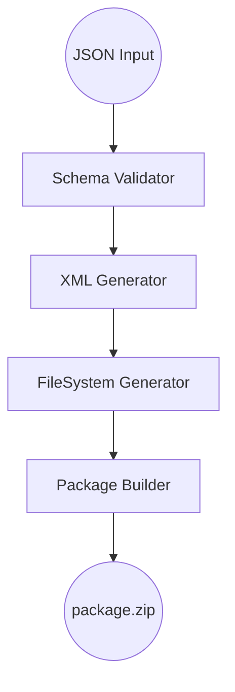

# 🏛️ Architecture — Salesforce Metadata Transpiler

This document describes the internal architecture, responsibilities, and data flow of the **Salesforce Metadata Transpiler**. It is intended for contributors and maintainers who want to understand *how* the system works and *where* to extend it safely.

---

## 🏗️ High-Level System Flow




---

## 🔬 Detailed Pipeline Walkthrough

This section illustrates how a single object definition flows through the core pipeline stages, including validation, hydration, XML generation, file path mapping, and packaging.

---

### 1️⃣ SchemaValidator

**Role**
Validates the incoming JSON against Zod schemas. Its most important responsibility is **hydration**: filling in mandatory Salesforce metadata fields that the user (or AI) may omit, ensuring downstream stages receive a complete and valid object.

**Input (Raw JSON)**

```json
{
  "fullName": "Vehicle__c",
  "label": "Vehicle",
  "fields": [
    { "fullName": "VIN__c", "type": "Text", "length": 17 }
  ]
}
```

**Output (Validated & Hydrated Object)**

```json
{
  "fullName": "Vehicle__c",
  "label": "Vehicle",
  "deploymentStatus": "Deployed",
  "sharingModel": "ReadWrite",
  "fields": [
    {
      "fullName": "VIN__c",
      "type": "Text",
      "label": "VIN",
      "length": 17,
      "required": false
    }
  ]
}
```

---

### 2️⃣ XML Generator

**Role**
Converts hydrated JSON objects into Salesforce-compliant XML strings. Handles **tag ordering, namespaces, and metadata-specific formatting**. Does not know anything about file paths or folder structures.

**Input (Hydrated Object)**

```json
{
  "fullName": "Vehicle__c",
  "label": "Vehicle",
  "deploymentStatus": "Deployed",
  "fields": [
    { "fullName": "VIN__c", "type": "Text", "label": "VIN", "length": 17 }
  ]
}
```

**Output (Metadata XML Objects)**

```json
[
  {
    "metadataType": "CustomObject",
    "apiName": "Vehicle__c",
    "xml": "<CustomObject xmlns=\"http://soap.sforce.com/2006/04/metadata\"><label>Vehicle</label>...</CustomObject>"
  },
  {
    "metadataType": "CustomField",
    "parent": "Vehicle__c",
    "apiName": "VIN__c",
    "xml": "<CustomField xmlns=\"http://soap.sforce.com/2006/04/metadata\"><fullName>VIN__c</fullName><type>Text</type>...</CustomField>"
  }
]
```

---

### 3️⃣ FileSystem Generator

**Role**
Takes the XML objects from the XML Generator and determines **the correct Salesforce file paths**. Produces a virtual file system array with `path` + `content` ready for packaging. This layer **does not generate XML**.

**Input (Metadata XML Objects)**

```json
[
  {
    "metadataType": "CustomObject",
    "apiName": "Vehicle__c",
    "xml": "<CustomObject>...</CustomObject>"
  },
  {
    "metadataType": "CustomField",
    "parent": "Vehicle__c",
    "apiName": "VIN__c",
    "xml": "<CustomField>...</CustomField>"
  }
]
```

**Output (File Mapping)**

```ts
[
  {
    path: "objects/Vehicle__c/Vehicle__c.object-meta.xml",
    content: "<CustomObject xmlns=\"...\">...</CustomObject>"
  },
  {
    path: "objects/Vehicle__c/fields/VIN__c.field-meta.xml",
    content: "<CustomField>...</CustomField>"
  }
]
```

---

### 4️⃣ Package Builder

**Role**
Scans the list of file paths returned by the FileSystem Generator, generates the `package.xml` manifest, and compresses the entire structure into a deployable ZIP archive.

**Input (File Mapping)**
```ts
[
  {
    path: "objects/Vehicle__c/Vehicle__c.object-meta.xml",
    content: "<CustomObject xmlns=\"...\">...</CustomObject>"
  },
  {
    path: "objects/Vehicle__c/fields/VIN__c.field-meta.xml",
    content: "<CustomField>...</CustomField>"
  }
]
```

**Output (Deployment Package)**
`deployable_package.zip` — containing the complete Salesforce-compatible folder structure and deployment manifest.

---
