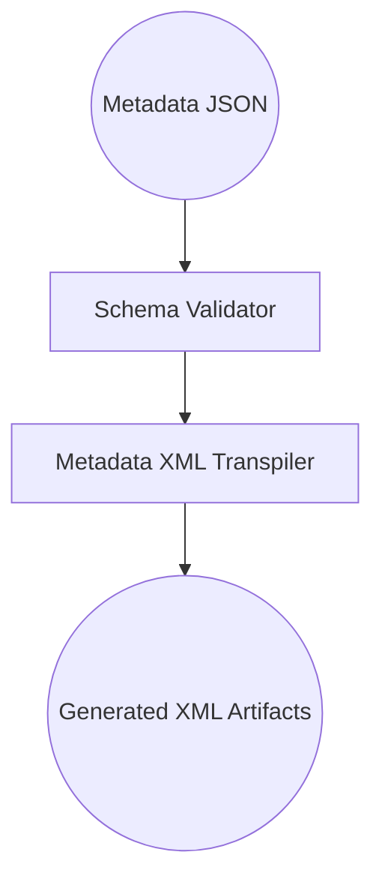

# 🏛️ Architecture — Salesforce Metadata Transpiler

This document describes the internal architecture, responsibilities, and data flow of the **Salesforce Metadata Transpiler**. It is intended for contributors and maintainers who want to understand *how* the system works and *where* to extend it safely.

The transpiler converts **JSON metadata definitions** into Salesforce-compliant XML artifacts. It treats JSON as the **source of truth**, and XML as a **transient build artifact**.

---

## 🏗️ High-Level System Flow


```mermaid
flowchart TD
    A((Metadata JSON)) --> B[Schema Validator]
    B --> C[Metadata XML Transpiler]
    C --> D((Generated XML Artifacts))
```

> Note: Packaging into a ZIP and deployment are handled outside the transpiler.

---

## 🎯 Core Design Principles

* **Single Responsibility** — The transpiler only generates XML
* **Stateless Processing** — One JSON schema in, XML artifacts out
* **Filesystem & Deployment Agnostic** — No paths, folders, or ZIPs are assumed
* **Composable Output** — Each XML artifact is independently consumable
* **Incremental Deploy Friendly** — Works with JSON diffs to regenerate only changed components

---

## 🔬 Detailed Pipeline Walkthrough

### 1️⃣ Schema Validator

* *See ****[docs/Validation.md](./Validation.md)**** for details*

**Role**

* Validates JSON metadata against schemas
* Hydrates missing mandatory Salesforce fields

**Input (Raw JSON)**

```json
{
  "fullName": "Vehicle__c",
  "label": "Vehicle",
  "fields": [
    { "fullName": "VIN__c", "type": "Text", "length": 17 }
  ]
}
```

**Output (Validated & Hydrated JSON)**

```json
{
  "fullName": "Vehicle__c",
  "label": "Vehicle",
  "deploymentStatus": "Deployed",
  "sharingModel": "ReadWrite",
  "fields": [
    {
      "fullName": "VIN__c",
      "type": "Text",
      "label": "VIN",
      "length": 17,
      "required": false
    }
  ]
}
```

---

### 2️⃣ Metadata XML Transpiler

* *See ****[docs/XmlGeneration.md](./XmlGeneration.md)**** for details*

**Role**

* Converts hydrated JSON into Salesforce XML artifacts
* Processes one JSON schema at a time
* Returns a **flat list of XML artifacts**

**Input (Hydrated JSON)**

```json
{
  "fullName": "Vehicle__c",
  "label": "Vehicle",
  "deploymentStatus": "Deployed",
  "fields": [
    { "fullName": "VIN__c", "type": "Text", "label": "VIN", "length": 17 }
  ]
}
```

**Output (Generated XML Artifacts)**

```json
[
  {
    "metadataType": "CustomObject",
    "apiName": "Vehicle__c",
    "xml": "<CustomObject xmlns=\"http://soap.sforce.com/2006/04/metadata\"><label>Vehicle</label>...</CustomObject>"
  },
  {
    "metadataType": "CustomField",
    "parent": "Vehicle__c",
    "apiName": "VIN__c",
    "xml": "<CustomField xmlns=\"http://soap.sforce.com/2006/04/metadata\"><fullName>VIN__c</fullName><type>Text</type>...</CustomField>"
  }
]
```

## &#x20;
