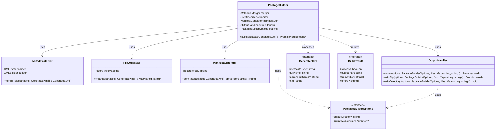

# Package Builder Documentation

## 1. Overview

### Purpose

The Package Builder is a modular orchestrator designed to take raw GeneratedXml artifacts, manipulate their structure for deployment, organize them into the correct file system layout, and generate the necessary package.xml manifest for Salesforce metadata deployments.

### Key Features

* **Field Merging**: Automatically merges individual CustomField XML artifacts into their parent CustomObject XML files.
* **Directory Organization**: Maps metadata types to specific Salesforce project directory structures (e.g., objects/, classes/).
* **Manifest Generation**: Dynamically creates a package.xml based on the processed artifacts.
* **Output Flexibility**: Supports writing directly to the local file system or creating a compressed .zip archive for deployment.
* **Modular Architecture**: Separate classes handle merging, organizing, manifest generation, and output writing.

### Class Diagram

#### Code snippet



### Project Structure

```text
packageBuilder/
├── types.ts
├── packageBuilder.ts          # Core Orchestrator
├── metadataMerger.ts          # Merges Fields into Objects
├── fileOrganizer.ts           # Maps to File System
├── manifestGenerator.ts       # Generates package.xml
└── outputHandler.ts           # Writes to Zip or Folder
```

## 2. Architecture

### Design Principles

* **Modular Orchestration**: The PackageBuilder class does not contain business logic for merging or organizing; it acts as a controller, delegating tasks to specialized modules.
* **Pure Functional Processing**: Components like MetadataMerger and FileOrganizer are designed to take input, return new output, and avoid side effects.
* **Environment Agnostic**: The OutputHandler abstracts away the specifics of interacting with the file system (fs) or compression (jszip).

### Component Flow

```text
Input XML Artifacts (GeneratedXml[])
    ↓
MetadataMerger (Merge Fields → Objects)
    ↓
FileOrganizer (Map Path → Content Map)
    ↓
ManifestGenerator (Create package.xml)
    ↓
OutputHandler (Write Files or Zip)
    ↓
Output: BuildResult
```

## 3. Core Components

### 3.1 PackageBuilder (Orchestrator)

**Location**: packageBuilder/packageBuilder.ts

**Responsibilities**:

* Initialize sub-modules (Merger, Organizer, ManifestGen, OutputHandler)
* Orchestrate the sequential flow of data
* Handle errors during the build process
* Consolidate results into a BuildResult object

**Class Definition**:

```ts
export class PackageBuilder {
  constructor(private options: PackageBuilderOptions)
  public async build(artifacts: GeneratedXml[]): Promise<BuildResult>
}
```

**Key Method**:

`build(artifacts: GeneratedXml[]): Promise<BuildResult>`

Executes the full pipeline.

**Process**:

* Calls merger.mergeFields() to consolidate CustomField XML into CustomObject XML.
* Calls organizer.organize() to map artifacts to file paths.
* Calls manifestGen.generate() to create the package.xml string.
* Adds package.xml to the file map.
* Calls outputHandler.write() to persist files.

### 3.2 MetadataMerger

**Location**: packageBuilder/metadataMerger.ts

**Purpose**: Combines individual XML strings for fields into the parent object XML string.

**Process**:

* Parses Object and Field XML strings into JSON objects using fast-xml-parser.
* Groups Fields by their parentFullName.
* Appends field JSON structures to the fields array of the parent object JSON.
* Rebuilds the Object JSON back into an XML string using fast-xml-parser.

### 3.3 FileOrganizer

**Location**: packageBuilder/fileOrganizer.ts

**Purpose**: Determines the correct directory structure based on metadataType.

**Responsibilities**:

* Maps metadata types to folder names (objects, classes, lwc).
* Applies correct file extensions (.object, .cls-meta.xml).
* Handles special directory structures (e.g., LWC bundles).

**Internal Mapping**:

```ts
private typeMapping = {
    'CustomObject': { folder: 'objects', ext: '.object' },
    'ApexClass': { folder: 'classes', ext: '.cls-meta.xml' },
    // ...
};
```

### 3.4 ManifestGenerator

**Location**: packageBuilder/manifestGenerator.ts

**Purpose**: Generates the package.xml file content.

**Responsibilities**:

* Groups artifact fullNames by metadataType.
* Sorts members alphabetically for consistent output.
* Formats XML according to Salesforce Metadata API standards.

### 3.5 OutputHandler

**Location**: packageBuilder/outputHandler.ts

**Purpose**: Writes the Map of files to the local file system or creates a ZIP archive.

**Modes**:

* **zip**: Uses JSZip to create a binary buffer and writes to a .zip file.
* **directory**: Uses node fs module to create directory structures and write individual files.

## 4. Type System

### 4.1 Interface Definitions

#### PackageBuilderOptions

Configuration for the output.

```ts
export interface PackageBuilderOptions {
  outputDirectory: string;        // File path or folder name
  outputMode: "zip" | "directory"; // Output format
}
```

#### BuildResult

Final outcome of the build process.

```ts
export interface BuildResult {
  success: boolean;              // Overall success status
  outputPath: string;            // Final location of artifacts
  filesWritten: string[];        // List of files created
  errors?: string[];             // Error messages if failed
}
```

## 5. Usage Examples

### 5.1 Setting up and Running a Build

```ts
import { PackageBuilder } from "./packageBuilder/packageBuilder";
import { GeneratedXml } from "./types"; // Assuming types shared

// 1. Raw XML Artifacts (from XML Generator)
const artifacts: GeneratedXml[] = [
  {
    metadataType: "CustomObject",
    fullName: "Product__c",
    xml: "<CustomObject>...</CustomObject>"
  },
  {
    metadataType: "CustomField",
    fullName: "Product__c.SKU__c",
    parentFullName: "Product__c",
    xml: "<CustomField>...</CustomField>"
  }
];

// 2. Configure Builder
const builder = new PackageBuilder({
  outputDirectory: "./deployments/my-package.zip",
  outputMode: "zip"
});

// 3. Run Build
async function runBuild() {
  const result = await builder.build(artifacts);
  
  if (result.success) {
    console.log(`Package written to: ${result.outputPath}`);
  } else {
    console.error("Build failed:", result.errors);
  }
}

runBuild();
```

### 5.2 Scenario: Directory Output (Debug Mode)

```ts
const debugBuilder = new PackageBuilder({
  outputDirectory: "./unzipped-files",
  outputMode: "directory"
});

// Result is a directory structure instead of a zip filed
```
