# XML Generator Documentation

## 1. Overview

### Purpose
The XML Generator is a modular system that converts JSON metadata definitions into Salesforce-compatible XML files. It handles CustomObjects and 20+ field types through a pluggable generator architecture.

### Key Features
- **Hierarchical Processing**: Automatically handles parent-child relationships (Objects → Fields)
- **Extensible Design**: Easy to add new generators without modifying core code
- **Type Safety**: TypeScript interfaces ensure data integrity
- **Priority-Based Routing**: Generators are selected based on priority and type matching

### Class Diagram

```mermaid
classDiagram
    %% Core Orchestrator
    class XmlGenerator {
        -AtomicGenerator[] generators
        +registerGenerator(gen: AtomicGenerator) void
        +generate(input: any) GeneratedXml[]
        -processRecursive(item: any, results: GeneratedXml[], context: GenerationContext) void
    }

    %% Core Interfaces
    class AtomicGenerator {
        <<interface>>
        +priority: number
        +supports(data: any) boolean
        +generate(data: T, context: GenerationContext) GeneratedXml
        +getChildItems(data: T) any[]
    }

    class GeneratedXml {
        <<interface>>
        +metadataType: string
        +fullName: string
        +parentFullName?: string
        +xml: string
    }

    class GenerationContext {
        <<interface>>
        +parentFullName?: string
    }

    %% Base Classes
    class BaseFieldGenerator {
        <<abstract>>
        #buildSharedTags(field: any) string[]
        #buildFullName(fieldName: string, context: GenerationContext) string
        #buildXmlFromTags(tags: string[]) string
    }

    %% Object Generator
    class CustomObjectGenerator {
        +priority: 10
        +supports(data: any) boolean
        +generate(obj: CustomObject, context: GenerationContext) GeneratedXml
        +getChildItems(data: CustomObject) JsonField[]
        -buildBody(obj: CustomObject) string
        -buildNameField(nameField: NameField) string
    }

    %% Specialized Field Generators
    class FormulaFieldGenerator {
        +priority: 20
        +supports(data: any) boolean
        +generate(field: FormulaField, context: GenerationContext) GeneratedXml
    }

    class LookupFieldGenerator {
        +priority: 20
        +supports(data: any) boolean
        +generate(field: LookupField, context: GenerationContext) GeneratedXml
    }

    class MasterDetailFieldGenerator {
        +priority: 20
        +supports(data: any) boolean
        +generate(field: MasterDetailField, context: GenerationContext) GeneratedXml
    }

    class PicklistFieldGenerator {
        +priority: 20
        +supports(data: any) boolean
        +generate(field: PicklistField, context: GenerationContext) GeneratedXml
        -buildValueSet(valueSet: ValueSet) string
    }

    class MultiselectPicklistFieldGenerator {
        +priority: 20
        +supports(data: any) boolean
        +generate(field: MultiselectPicklistField, context: GenerationContext) GeneratedXml
        -buildValueSet(valueSet: ValueSet) string
    }

    class GenericFieldGenerator {
        +priority: 30
        +supports(data: any) boolean
        +generate(field: BaseJsonField, context: GenerationContext) GeneratedXml
        -buildTypeSpecificTags(field: any) string[]
    }

    %% Type Interfaces
    class BaseJsonField {
        <<interface>>
        +fullName: string
        +label: string
        +description?: string
        +inlineHelpText?: string
        +required?: boolean
        +unique?: boolean
        +externalId?: boolean
        +trackHistory?: boolean
        +trackTrending?: boolean
    }

    class CustomObject {
        <<interface>>
        +type: "CustomObject"
        +fullName: string
        +label: string
        +pluralLabel: string
        +nameField: NameField
        +fields?: JsonField[]
        +deploymentStatus: string
        +enableActivities?: boolean
        +enableReports?: boolean
    }

    class FormulaField {
        <<interface>>
        +type: "Formula"
        +formula: string
        +blankOption?: string
    }

    class LookupField {
        <<interface>>
        +type: "Lookup"
        +referenceTo: string
        +relationshipName: string
        +relationshipLabel: string
        +deleteConstraint?: string
    }

    class MasterDetailField {
        <<interface>>
        +type: "MasterDetail"
        +referenceTo: string
        +relationshipName: string
        +relationshipLabel: string
        +relationshipOrder?: number
        +reparentableMasterDetail?: boolean
    }

    class PicklistField {
        <<interface>>
        +type: "Picklist"
        +valueSet: ValueSet
    }

    class MultiselectPicklistField {
        <<interface>>
        +type: "MultiselectPicklist"
        +valueSet: ValueSet
        +visibleLines?: number
    }

    class ValueSet {
        <<interface>>
        +restricted: boolean
        +sorted?: boolean
        +values: PicklistValue[]
    }

    class PicklistValue {
        <<interface>>
        +fullName: string
        +label: string
        +default: boolean
    }

    class NameField {
        <<interface>>
        +label: string
        +type: string
        +trackHistory: boolean
    }

    %% Utility Class
    class XmlUtils {
        <<utility>>
        +xmlTag(tagName: string, value: any)$ string
        +escapeXml(text: string)$ string
        +buildXmlDocument(rootTag: string, namespace: string, body: string)$ string
    }

    %% Relationships - Implementation
    XmlGenerator o-- AtomicGenerator : manages
    CustomObjectGenerator ..|> AtomicGenerator : implements
    BaseFieldGenerator ..|> AtomicGenerator : implements
    
    FormulaFieldGenerator --|> BaseFieldGenerator : extends
    LookupFieldGenerator --|> BaseFieldGenerator : extends
    MasterDetailFieldGenerator --|> BaseFieldGenerator : extends
    PicklistFieldGenerator --|> BaseFieldGenerator : extends
    MultiselectPicklistFieldGenerator --|> BaseFieldGenerator : extends
    GenericFieldGenerator --|> BaseFieldGenerator : extends

    %% Relationships - Type Usage
    FormulaField --|> BaseJsonField : extends
    LookupField --|> BaseJsonField : extends
    MasterDetailField --|> BaseJsonField : extends
    PicklistField --|> BaseJsonField : extends
    MultiselectPicklistField --|> BaseJsonField : extends

    PicklistField --> ValueSet : contains
    MultiselectPicklistField --> ValueSet : contains
    ValueSet --> PicklistValue : contains
    CustomObject --> NameField : contains

    %% Relationships - Dependencies
    XmlGenerator ..> GeneratedXml : produces
    XmlGenerator ..> GenerationContext : uses
    AtomicGenerator ..> GeneratedXml : returns
    AtomicGenerator ..> GenerationContext : receives

    CustomObjectGenerator ..> CustomObject : processes
    FormulaFieldGenerator ..> FormulaField : processes
    LookupFieldGenerator ..> LookupField : processes
    MasterDetailFieldGenerator ..> MasterDetailField : processes
    PicklistFieldGenerator ..> PicklistField : processes
    MultiselectPicklistFieldGenerator ..> MultiselectPicklistField : processes
    GenericFieldGenerator ..> BaseJsonField : processes

    BaseFieldGenerator ..> XmlUtils : uses
    CustomObjectGenerator ..> XmlUtils : uses
    PicklistFieldGenerator ..> XmlUtils : uses
    MultiselectPicklistFieldGenerator ..> XmlUtils : uses

    %% Notes
    note for XmlGenerator "Orchestrates generation\nprocess and manages\ngenerator registry"
    note for AtomicGenerator "Contract for all\ngenerators"
    note for BaseFieldGenerator "Shared utilities\nfor field generators"
    note for GenericFieldGenerator "Fallback handler\nfor 17 simple types\n(priority: 30)"

```



### Project Structure
```
xmlGenerator/
├── generators/
│   ├── customObjects/
│   │   ├── fields/
│   │   │   ├── formula.ts
│   │   │   ├── genericFieldGenerator.ts
│   │   │   ├── lookUp.ts
│   │   │   ├── masterDetail.ts
│   │   │   ├── picklist.ts
│   │   │   ├── multiSelectPicklist.ts
│   │   │   └── index.ts
│   │   └── object.ts
│   ├── atomicGenerator.ts
│   └── baseFieldGenerator.ts
├── utils/
│   └── xmlUtils.ts
├── index.ts
├── orchestrator.ts
└── types.ts
```

---

## 2. Architecture

### Design Principles

**Single Responsibility**: Each generator handles exactly one metadata type.

**Open/Closed Principle**: System is open for extension (add new generators) but closed for modification (core logic unchanged).

**Type Safety**: TypeScript type guards ensure only compatible data reaches each generator.

### Component Flow
```
Input JSON
    ↓
XmlGenerator (Orchestrator)
    ↓
Find Matching Generator (via supports())
    ↓
Generate XML + Extract Children
    ↓
Process Children Recursively
    ↓
Output: GeneratedXml[]
```

---

## 3. Core Components

### 3.1 XmlGenerator (Orchestrator)

**Location**: `xmlGenerator/orchestrator.ts`

**Responsibilities**:
- Maintain registry of all generators
- Route metadata to appropriate generator
- Manage parent-child context propagation
- Collect and return all generated XML

**Class Definition**:
```typescript
export class XmlGenerator {
  private generators: AtomicGenerator[] = [];

  registerGenerator(gen: AtomicGenerator): void
  generate(input: any): GeneratedXml[]
  private processRecursive(item: any, results: GeneratedXml[], context: GenerationContext): void
}
```

**Key Methods**:

#### `registerGenerator(gen: AtomicGenerator)`
Registers a generator and sorts by priority (lower number = higher priority).

**Example**:
```typescript
const orchestrator = new XmlGenerator();
orchestrator.registerGenerator(new CustomObjectGenerator());
orchestrator.registerGenerator(new FormulaFieldGenerator());
```

#### `generate(input: any): GeneratedXml[]`
Main entry point. Initiates recursive processing with empty context.

**Parameters**:
- `input`: JSON metadata object (CustomObject, Field, etc.)

**Returns**: Array of `GeneratedXml` objects

**Example**:
```typescript
const results = orchestrator.generate({
  type: "CustomObject",
  fullName: "Product__c",
  label: "Product",
  fields: [...]
});
// Returns: [CustomObject XML, Field1 XML, Field2 XML, ...]
```

#### `processRecursive(item, results, context)` (Private)
Recursively processes metadata tree.

**Algorithm**:
1. Find generator using `supports()` type guard
2. Generate XML for current item
3. If generator has `getChildItems()`, extract children
4. Create new context with current item's `fullName` as parent
5. Recursively process each child
6. Warn if no generator found

**Context Propagation**:
```typescript
// Parent object
context = {}
→ generates "Product__c"

// Child field
context = { parentFullName: "Product__c" }
→ generates "Product__c.Name__c"
```

---

### 3.2 AtomicGenerator Interface

**Location**: `xmlGenerator/generators/atomicGenerator.ts`

**Purpose**: Contract that all generators must implement.

**Interface**:
```typescript
export interface AtomicGenerator<T = any> {
  readonly priority: number;
  supports(data: any): data is T;
  generate(data: T, context: GenerationContext): GeneratedXml;
  getChildItems?(data: T): any[];
}
```

**Properties**:

| Property | Type | Required | Description |
|----------|------|----------|-------------|
| `priority` | `number` | Yes | Execution order (10 = first, 30 = last) |
| `supports` | `function` | Yes | Type guard returning true if generator handles this data |
| `generate` | `function` | Yes | Converts data to XML |
| `getChildItems` | `function` | No | Returns child metadata for recursive processing |

**Priority Guidelines**:
- **10**: Top-level metadata (CustomObject)
- **20**: Specialized fields (Formula, Lookup, Picklist)
- **30**: Generic/fallback handlers (GenericFieldGenerator)

---

### 3.3 BaseFieldGenerator

**Location**: `xmlGenerator/generators/baseFieldGenerator.ts`

**Purpose**: Abstract base class providing shared utilities for all field generators.

**Protected Methods**:

#### `buildSharedTags(field: any): string[]`
Generates common XML tags present in all fields.

**Returns**: Array of XML tag strings for:
- fullName, label, type
- description, inlineHelpText
- trackHistory, trackTrending
- externalId, required, unique

**Usage**:
```typescript
const tags = [
  ...this.buildSharedTags(field),
  XmlUtils.xmlTag("formula", field.formula)
];
```

#### `buildFullName(fieldName: string, context: GenerationContext): string`
Combines parent object name with field name.

**Logic**:
```typescript
context.parentFullName 
  ? `${context.parentFullName}.${fieldName}` 
  : fieldName
```

**Examples**:
- With parent: `"Product__c.Name__c"`
- Without parent: `"Name__c"`

#### `buildXmlFromTags(tags: string[]): string`
Converts tag array into complete XML document.

**Process**:
1. Filter out empty tags
2. Join with newlines and indentation
3. Wrap in CustomField XML envelope with namespace

**Output Template**:
```xml
<?xml version="1.0" encoding="UTF-8"?>
<CustomField xmlns="http://soap.sforce.com/2006/04/metadata">
    <tag1>value1</tag1>
    <tag2>value2</tag2>
</CustomField>
```

---

## 4. Field Generators

### 4.1 Priority System

| Priority | Generator | Field Types |
|----------|-----------|-------------|
| 10 | CustomObjectGenerator | CustomObject |
| 20 | FormulaFieldGenerator | Formula |
| 20 | LookupFieldGenerator | Lookup |
| 20 | MasterDetailFieldGenerator | MasterDetail |
| 20 | PicklistFieldGenerator | Picklist |
| 20 | MultiselectPicklistFieldGenerator | MultiselectPicklist |
| 30 | GenericFieldGenerator | Text, Number, Email, etc. (17 types) |

---

### 4.2 CustomObjectGenerator

**Location**: `xmlGenerator/generators/customObjects/object.ts`

**Supports**: `type: "CustomObject"`

**Type Guard**:
```typescript
supports(data: any): data is CustomObject {
  return data.type === "CustomObject" 
    && data.label !== undefined 
    && data.pluralLabel !== undefined;
}
```

**Children**: Returns `data.fields || []`

**Special Handling**:
- Generates nested `<nameField>` XML structure
- Handles all platform enablement settings (Activities, Reports, etc.)
- No parent context (top-level metadata)

**Generated XML Structure**:
```xml
<CustomObject xmlns="http://soap.sforce.com/2006/04/metadata">
    <deploymentStatus>Deployed</deploymentStatus>
    <label>Product</label>
    <pluralLabel>Products</pluralLabel>
    <nameField>
        <label>Product Name</label>
        <type>Text</type>
    </nameField>
    <enableActivities>true</enableActivities>
    <!-- ... more settings -->
</CustomObject>
```

**Implementation Notes**:
- `buildNameField()` creates nested XML manually (not using xmlTag)
- Tags are filtered to remove empty values before joining

---

### 4.3 Specialized Field Generators

#### FormulaFieldGenerator

**Location**: `xmlGenerator/generators/customObjects/fields/formula.ts`

**Supports**: `type: "Formula"`

**Special Handling**:
- XML-escapes formula expressions via `XmlUtils.xmlTag()`
- Handles `formulaTreatBlanksAs` (BlankAsZero, BlankAsBlank)

**Example Input**:
```typescript
{
  type: "Formula",
  fullName: "Status__c",
  label: "Status",
  formula: 'IF(Active__c, "Yes", "No")',
  blankOption: "BlankAsZero"
}
```

**Generated Tags**:
```xml
<formula>IF(Active__c, &quot;Yes&quot;, &quot;No&quot;)</formula>
<formulaTreatBlanksAs>BlankAsZero</formulaTreatBlanksAs>
```

**Implementation**:
```typescript
generate(field: FormulaField, context: GenerationContext): GeneratedXml {
  const fullName = this.buildFullName(field.fullName, context);
  const parentFullName = context.parentFullName;

  const tags = [
    ...this.buildSharedTags(field),
    XmlUtils.xmlTag("formula", field.formula),
    XmlUtils.xmlTag("formulaTreatBlanksAs", field.blankOption),
  ];

  const xml = this.buildXmlFromTags(tags);

  return {
    metadataType: "CustomField",
    fullName,
    parentFullName,
    xml,
  };
}
```

---

#### LookupFieldGenerator

**Location**: `xmlGenerator/generators/customObjects/fields/lookUp.ts`

**Supports**: `type: "Lookup"`

**Key Properties**:
- `referenceTo`: Target object API name
- `relationshipName`: API name for child-to-parent traversal
- `relationshipLabel`: UI label for related list
- `deleteConstraint`: `SetNull` | `Restrict`

**Example Input**:
```typescript
{
  type: "Lookup",
  fullName: "Account__c",
  label: "Account",
  referenceTo: "Account",
  relationshipName: "Products",
  relationshipLabel: "Products",
  deleteConstraint: "SetNull"
}
```

**Generated Tags**:
```xml
<referenceTo>Account</referenceTo>
<relationshipName>Products</relationshipName>
<relationshipLabel>Products</relationshipLabel>
<deleteConstraint>SetNull</deleteConstraint>
```

---

#### MasterDetailFieldGenerator

**Location**: `xmlGenerator/generators/customObjects/fields/masterDetail.ts`

**Supports**: `type: "MasterDetail"`

**Additional Properties** (beyond Lookup):
- `relationshipOrder`: Display order in roll-up summaries
- `reparentableMasterDetail`: Allow changing parent record
- `writeRequiresMasterRead`: Inherit master security

**Example Input**:
```typescript
{
  type: "MasterDetail",
  fullName: "Account__c",
  label: "Account",
  referenceTo: "Account",
  relationshipName: "Contacts",
  relationshipLabel: "Contacts",
  relationshipOrder: 0,
  reparentableMasterDetail: false,
  writeRequiresMasterRead: true
}
```

**Behavior**:
- Cannot be optional (always required)
- Cascade delete by default
- Controls roll-up summary eligibility

---

#### PicklistFieldGenerator

**Location**: `xmlGenerator/generators/customObjects/fields/picklist.ts`

**Supports**: `type: "Picklist"`

**Complex Structure**: Handles nested `valueSet` with array of picklist values.

**Example Input**:
```typescript
{
  type: "Picklist",
  fullName: "Status__c",
  label: "Status",
  valueSet: {
    restricted: true,
    sorted: false,
    values: [
      { fullName: "New", label: "New", default: true },
      { fullName: "Active", label: "Active", default: false },
      { fullName: "Closed", label: "Closed", default: false }
    ]
  }
}
```

**Generated XML**:
```xml
<valueSet>
    <restricted>true</restricted>
    <valueSetDefinition>
        <sorted>false</sorted>
        <value>
            <fullName>New</fullName>
            <default>true</default>
            <label>New</label>
        </value>
        <value>
            <fullName>Active</fullName>
            <default>false</default>
            <label>Active</label>
        </value>
        <value>
            <fullName>Closed</fullName>
            <default>false</default>
            <label>Closed</label>
        </value>
    </valueSetDefinition>
</valueSet>
```

**Implementation Details**:
```typescript
private buildValueSet(valueSet: any): string {
  const values = valueSet.values.map((v: any) => `
        <value>
            <fullName>${XmlUtils.escapeXml(v.fullName)}</fullName>
            <default>${v.default}</default>
            <label>${XmlUtils.escapeXml(v.label)}</label>
        </value>`).join('');

  return `<valueSet>
        <restricted>${valueSet.restricted}</restricted>
        <valueSetDefinition>
            <sorted>${valueSet.sorted || false}</sorted>${values}
        </valueSetDefinition>
    </valueSet>`;
}
```

---

#### MultiselectPicklistFieldGenerator

**Location**: `xmlGenerator/generators/customObjects/fields/multiSelectPicklist.ts`

**Supports**: `type: "MultiselectPicklist"`

**Extends Picklist With**:
- `visibleLines`: Number of visible options in UI (default: 4)

**Example Input**:
```typescript
{
  type: "MultiselectPicklist",
  fullName: "Skills__c",
  label: "Skills",
  visibleLines: 6,
  valueSet: {
    restricted: true,
    values: [...]
  }
}
```

**Additional Tag**:
```xml
<visibleLines>6</visibleLines>
```

**Note**: Uses same `buildValueSet()` logic as PicklistFieldGenerator.

---

### 4.4 GenericFieldGenerator

**Location**: `xmlGenerator/generators/customObjects/fields/genericFieldGenerator.ts`

**Priority**: 30 (lowest - fallback handler)

**Supported Types** (17 total):
- AutoNumber
- Checkbox
- Currency
- Date
- DateTime
- Email
- Location (Geolocation)
- Number
- Percent
- Phone
- Text
- TextArea
- EncryptedText
- LongTextArea
- Html (Rich Text)
- Time
- Url

**Strategy**: Dynamic property-to-XML-tag mapping

**Type Guard**:
```typescript
const SIMPLE_FIELD_TYPES = [
  "AutoNumber", "Checkbox", "Currency", "Date", "DateTime",
  "Email", "Location", "Number", "Percent", "Phone",
  "Text", "TextArea", "EncryptedText", "LongTextArea",
  "Html", "Time", "Url"
] as const;

supports(data: any): data is BaseJsonField {
  return SIMPLE_FIELD_TYPES.includes(data.type);
}
```

**Implementation**:
```typescript
private buildTypeSpecificTags(field: any): string[] {
  const tags: string[] = [];
  
  const excludedKeys = new Set([
    'type', 'label', 'fullName', 'description', 'inlineHelpText',
    'trackHistory', 'trackTrending', 'externalId', 'required', 'unique'
  ]);

  for (const [key, value] of Object.entries(field)) {
    if (!excludedKeys.has(key) && value !== undefined && value !== null) {
      tags.push(XmlUtils.xmlTag(key, value));
    }
  }

  return tags;
}
```

**Example Transformations**:

**Input: Currency Field**
```typescript
{
  type: "Currency",
  fullName: "Price__c",
  label: "Price",
  precision: 14,
  scale: 2,
  defaultValue: 0
}
```

**Generated Tags**:
```xml
<!-- Shared tags from buildSharedTags() -->
<fullName>Price__c</fullName>
<label>Price</label>
<type>Currency</type>

<!-- Type-specific tags from buildTypeSpecificTags() -->
<precision>14</precision>
<scale>2</scale>
<defaultValue>0</defaultValue>
```

**Input: Email Field**
```typescript
{
  type: "Email",
  fullName: "Email__c",
  label: "Email",
  unique: true,
  caseSensitive: false
}
```

**Generated Tags**:
```xml
<!-- caseSensitive auto-mapped by GenericFieldGenerator -->
<caseSensitive>false</caseSensitive>
```

---

## 5. Type System

### 5.1 Core Interfaces

#### GeneratedXml
Output format for all generators.

```typescript
export interface GeneratedXml {
  metadataType: string;      // "CustomObject" | "CustomField"
  fullName: string;          // "Product__c" | "Product__c.Name__c"
  parentFullName?: string;   // "Product__c" (for fields)
  xml: string;               // Complete XML document
}
```

**Example**:
```typescript
{
  metadataType: "CustomField",
  fullName: "Product__c.Name__c",
  parentFullName: "Product__c",
  xml: "<?xml version=\"1.0\" encoding=\"UTF-8\"?>\n<CustomField>...</CustomField>"
}
```

#### GenerationContext
Tracks parent information during recursive processing.

```typescript
export interface GenerationContext {
  parentFullName?: string;   // Set when processing children
}
```

**Context Evolution**:
```
CustomObject (no context)
  → Field 1 (context: { parentFullName: "Product__c" })
  → Field 2 (context: { parentFullName: "Product__c" })
```

---

### 5.2 Metadata Type Definitions

#### BaseJsonField
Common properties for all field types.

```typescript
export interface BaseJsonField {
  fullName: string;           // API name (e.g., "Status__c")
  label: string;              // Display name
  description?: string;       // Admin documentation
  inlineHelpText?: string;    // User help text
  helpText?: string;          // Alias for inlineHelpText
  required?: boolean;         // Mandatory field
  unique?: boolean;           // Enforce uniqueness
  externalId?: boolean;       // Use in upsert operations
  trackHistory?: boolean;     // Enable field history
  trackTrending?: boolean;    // Enable trending analytics
}
```

#### CustomObject
Top-level object definition.

```typescript
export interface CustomObject {
  type: "CustomObject";
  label: string;
  fullName: string;
  pluralLabel: string;
  description?: string;
  deploymentStatus: string;
  
  nameField: NameField;
  fields?: JsonField[];
  
  // Platform Settings
  allowInChatterGroups?: boolean;
  enableActivities?: boolean;
  enableBulkApi?: boolean;
  enableFeeds?: boolean;
  enableHistory?: boolean;
  enableLicensing?: boolean;
  enableReports?: boolean;
  enableSearch?: boolean;
  enableSharing?: boolean;
  enableStreamingApi?: boolean;
  visibility?: string;
}
```

#### NameField
Special configuration for the Name field.

```typescript
export interface NameField {
  label: string;         // e.g., "Product Name"
  type: string;          // "Text" | "AutoNumber"
  trackHistory: boolean;
}
```

---

### 5.3 Field Type Definitions

#### FormulaField
```typescript
export interface FormulaField extends BaseJsonField {
  type: "Formula";
  formula: string;           // Salesforce formula expression
  blankOption?: string;      // "BlankAsZero" | "BlankAsBlank"
}
```

#### LookupField
```typescript
export interface LookupField extends BaseJsonField {
  type: "Lookup";
  referenceTo: string;           // Target object
  relationshipLabel: string;     // Related list label
  relationshipName: string;      // API relationship name
  deleteConstraint?: string;     // "SetNull" | "Restrict"
}
```

#### MasterDetailField
```typescript
export interface MasterDetailField extends BaseJsonField {
  type: "MasterDetail";
  referenceTo: string;
  relationshipLabel: string;
  relationshipName: string;
  relationshipOrder?: number;
  reparentableMasterDetail?: boolean;
  writeRequiresMasterRead?: boolean;
}
```

#### PicklistField
```typescript
export interface PicklistValue {
  fullName: string;
  label: string;
  default: boolean;
}

export interface ValueSet {
  restricted: boolean;
  sorted?: boolean;
  values: PicklistValue[];
}

export interface PicklistField extends BaseJsonField {
  type: "Picklist";
  valueSet: ValueSet;
}
```

#### MultiselectPicklistField
```typescript
export interface MultiselectPicklistField extends BaseJsonField {
  type: "MultiselectPicklist";
  valueSet: ValueSet;
  visibleLines?: number;
}
```

#### TextField
```typescript
export interface TextField extends BaseJsonField {
  type: "Text";
  length?: number;   // Max: 255
}
```

#### NumberField
```typescript
export interface NumberField extends BaseJsonField {
  type: "Number";
  precision?: number;   // Total digits
  scale?: number;       // Decimal places
}
```

#### JsonField Union
```typescript
export type JsonField = 
  | FormulaField 
  | LookupField 
  | MasterDetailField
  | PicklistField
  | MultiselectPicklistField
  | TextField 
  | NumberField;
```

---

## 6. Usage Examples

### 6.1 Basic Setup

```typescript
import { createXmlGenerator } from "./xmlGenerator";

// Create orchestrator with all generators registered
const orchestrator = createXmlGenerator();
```

---

### 6.2 Generate Simple Object with Text Field

```typescript
const metadata = {
  type: "CustomObject",
  fullName: "Product__c",
  label: "Product",
  pluralLabel: "Products",
  deploymentStatus: "Deployed",
  nameField: {
    label: "Product Name",
    type: "Text",
    trackHistory: false
  },
  fields: [
    {
      type: "Text",
      fullName: "SKU__c",
      label: "SKU",
      length: 50,
      required: true
    }
  ]
};

const results = orchestrator.generate(metadata);

// Output:
// [
//   {
//     metadataType: "CustomObject",
//     fullName: "Product__c",
//     xml: "<CustomObject>...</CustomObject>"
//   },
//   {
//     metadataType: "CustomField",
//     fullName: "Product__c.SKU__c",
//     parentFullName: "Product__c",
//     xml: "<CustomField>...</CustomField>"
//   }
// ]
```

---

### 6.3 Generate Object with Multiple Field Types

```typescript
const complexObject = {
  type: "CustomObject",
  fullName: "Opportunity__c",
  label: "Opportunity",
  pluralLabel: "Opportunities",
  deploymentStatus: "Deployed",
  nameField: {
    label: "Opportunity Name",
    type: "Text",
    trackHistory: true
  },
  fields: [
    {
      type: "Currency",
      fullName: "Amount__c",
      label: "Amount",
      precision: 14,
      scale: 2,
      required: true
    },
    {
      type: "Picklist",
      fullName: "Stage__c",
      label: "Stage",
      valueSet: {
        restricted: true,
        sorted: false,
        values: [
          { fullName: "Prospecting", label: "Prospecting", default: true },
          { fullName: "Qualification", label: "Qualification", default: false },
          { fullName: "Closed Won", label: "Closed Won", default: false }
        ]
      }
    },
    {
      type: "Formula",
      fullName: "Days_Open__c",
      label: "Days Open",
      formula: "TODAY() - CreatedDate",
      blankOption: "BlankAsZero"
    },
    {
      type: "Lookup",
      fullName: "Account__c",
      label: "Account",
      referenceTo: "Account",
      relationshipName: "Opportunities",
      relationshipLabel: "Opportunities",
      deleteConstraint: "SetNull"
    }
  ]
};

const results = orchestrator.generate(complexObject);
// Returns 5 GeneratedXml objects (1 object + 4 fields)
```

---

### 6.4 Processing Output

```typescript
const results = orchestrator.generate(metadata);

results.forEach(item => {
  console.log(`Type: ${item.metadataType}`);
  console.log(`API Name: ${item.fullName}`);
  
  if (item.parentFullName) {
    console.log(`Parent: ${item.parentFullName}`);
  }
  
  console.log(`XML:\n${item.xml}\n`);
});
```

---

### 6.5 Writing to Files

```typescript
import fs from 'fs';
import path from 'path';

const results = orchestrator.generate(metadata);

results.forEach(item => {
  let filePath;
  
  if (item.metadataType === "CustomObject") {
    // objects/Product__c/Product__c.object-meta.xml
    filePath = path.join(
      'objects',
      item.fullName,
      `${item.fullName}.object-meta.xml`
    );
  } else if (item.metadataType === "CustomField") {
    // objects/Product__c/fields/SKU__c.field-meta.xml
    const [objectName, fieldName] = item.fullName.split('.');
    filePath = path.join(
      'objects',
      objectName,
      'fields',
      `${fieldName}.field-meta.xml`
    );
  }
  
  fs.mkdirSync(path.dirname(filePath), { recursive: true });
  fs.writeFileSync(filePath, item.xml, 'utf-8');
});
```

---

## 7. Extension Guide

### 7.1 Adding a New Simple Field Type

**Step 1**: Add type to GenericFieldGenerator's supported list

```typescript
// In genericFieldGenerator.ts
const SIMPLE_FIELD_TYPES = [
  "AutoNumber", "Checkbox", 
  // ... existing types ...
  "YourNewType"  // Add here
] as const;
```

**Step 2**: Define TypeScript interface

```typescript
// In types.ts
export interface YourNewField extends BaseJsonField {
  type: "YourNewType";
  customProperty?: string;
}

// Add to JsonField union
export type JsonField = 
  | FormulaField 
  | YourNewField  // Add here
  | TextField 
  | NumberField;
```

**Done!** GenericFieldGenerator will handle it automatically.

---

### 7.2 Adding a Complex Field Type

**Step 1**: Define interface

```typescript
// In types.ts
export interface ComplexField extends BaseJsonField {
  type: "ComplexType";
  nestedStructure: {
    property1: string;
    property2: number;
  };
}
```

**Step 2**: Create dedicated generator

```typescript
// In generators/customObjects/fields/complex.ts
import { BaseFieldGenerator } from "../../baseFieldGenerator";
import { AtomicGenerator } from "../../atomicGenerator";
import { ComplexField } from "../../../types";
import { GenerationContext, GeneratedXml } from "../../../types";
import { XmlUtils } from "../../../utils/xmlUtils";

export class ComplexFieldGenerator 
  extends BaseFieldGenerator 
  implements AtomicGenerator<ComplexField> {
  
  readonly priority = 20;

  supports(data: any): data is ComplexField {
    return data.type === "ComplexType";
  }

  generate(field: ComplexField, context: GenerationContext): GeneratedXml {
    const fullName = this.buildFullName(field.fullName, context);
    const parentFullName = context.parentFullName;

    const nestedXml = this.buildNestedStructure(field.nestedStructure);

    const tags = [
      ...this.buildSharedTags(field),
      nestedXml,
    ];

    const xml = this.buildXmlFromTags(tags);

    return {
      metadataType: "CustomField",
      fullName,
      parentFullName,
      xml,
    };
  }

  private buildNestedStructure(nested: any): string {
    return `<nestedStructure>
        <property1>${XmlUtils.escapeXml(nested.property1)}</property1>
        <property2>${nested.property2}</property2>
    </nestedStructure>`;
  }
}
```

**Step 3**: Register generator

```typescript
// In index.ts
import { ComplexFieldGenerator } from "./generators/customObjects/fields/complex";

export function createXmlGenerator(): XmlGenerator {
  const orchestrator = new XmlGenerator();
  
  // ... existing registrations ...
  orchestrator.registerGenerator(new ComplexFieldGenerator());
  
  return orchestrator;
}
```

---

### 7.3 Adding a Non-Field Metadata Type

Example: Adding ValidationRule support

**Step 1**: Define interface

```typescript
export interface ValidationRule {
  type: "ValidationRule";
  fullName: string;
  errorConditionFormula: string;
  errorMessage: string;
  active: boolean;
}
```

**Step 2**: Create generator (does NOT extend BaseFieldGenerator)

```typescript
export class ValidationRuleGenerator 
  implements AtomicGenerator<ValidationRule> {
  
  readonly priority = 15;  // Between objects and fields

  supports(data: any): data is ValidationRule {
    return data.type === "ValidationRule";
  }

  generate(rule: ValidationRule, context: GenerationContext): GeneratedXml {
    const fullName = context.parentFullName 
      ? `${context.parentFullName}.${rule.fullName}`
      : rule.fullName;

    const body = `
    <fullName>${rule.fullName}</fullName>
    <active>${rule.active}</active>
    <errorConditionFormula>${XmlUtils.escapeXml(rule.errorConditionFormula)}</errorConditionFormula>
    <errorMessage>${XmlUtils.escapeXml(rule.errorMessage)}</errorMessage>`;

    const xml = XmlUtils.buildXmlDocument(
      "ValidationRule",
      "http://soap.sforce.com/2006/04/metadata",
      body
    );

    return {
      metadataType: "ValidationRule",
      fullName,
      parentFullName: context.parentFullName,
      xml,
    };
  }
}
```

**Step 3**: Update CustomObject to include validation rules

```typescript
export interface CustomObject {
  // ... existing properties ...
  validationRules?: ValidationRule[];
}

// In CustomObjectGenerator
getChildItems(data: CustomObject): any[] {
  return [
    ...(data.fields || []),
    ...(data.validationRules || [])
  ];
}
```

---

### 7.4 Best Practices

**Priority Selection**:
- Lower number = processed first
- Group related generators (all fields at 20, all objects at 10)
- Leave gaps for future insertion (10, 20, 30 not 1, 2, 3)

**Type Guards**:
- Check minimum required properties
- Use strict equality for type field (`===` not `==`)
- Return type should be type predicate (`data is T`)

**XML Generation**:
- Always use `XmlUtils.escapeXml()` for user-provided strings
- Use `XmlUtils.xmlTag()` for simple tags
- Build complex structures manually when needed
- Filter empty tags before joining

**Context Management**:
- Always propagate `parentFullName` in return value
- Use `buildFullName()` for consistency
- Don't modify context object (immutable pattern)

**Testing**:
- Test with empty/null/undefined optional fields
- Verify XML escaping (quotes, ampersands, etc.)
- Check parent-child fullName composition
- Validate against Salesforce metadata API schema

---

## Appendix: Complete Generator Registry

Current generators registered in `createXmlGenerator()`:

```typescript
export function createXmlGenerator(): XmlGenerator {
  const orchestrator = new XmlGenerator();

  // Priority 10: Objects
  orchestrator.registerGenerator(new CustomObjectGenerator());

  // Priority 20: Specialized Fields
  orchestrator.registerGenerator(new FormulaFieldGenerator());
  orchestrator.registerGenerator(new LookupFieldGenerator());
  orchestrator.registerGenerator(new MasterDetailFieldGenerator());
  orchestrator.registerGenerator(new PicklistFieldGenerator());
  orchestrator.registerGenerator(new MultiselectPicklistFieldGenerator());
  orchestrator.registerGenerator(new TextFieldGenerator());  // Example specialized

  // Priority 30: Generic Fallback
  orchestrator.registerGenerator(new GenericFieldGenerator());

  return orchestrator;
}
```

**Note**: GenericFieldGenerator must be registered last (highest priority number) to act as fallback for simple field types not handled by specialized generators.

---

## Conclusion

The XML Generator provides a robust, extensible system for converting JSON metadata to Salesforce XML. Its modular architecture makes it easy to add new metadata types while maintaining clean separation of concerns. The priority-based routing ensures specialized generators handle complex cases while the generic generator provides fallback support for simple field types.

For questions or contributions, refer to the type definitions in `types.ts` and follow the extension patterns outlined in Section 7.