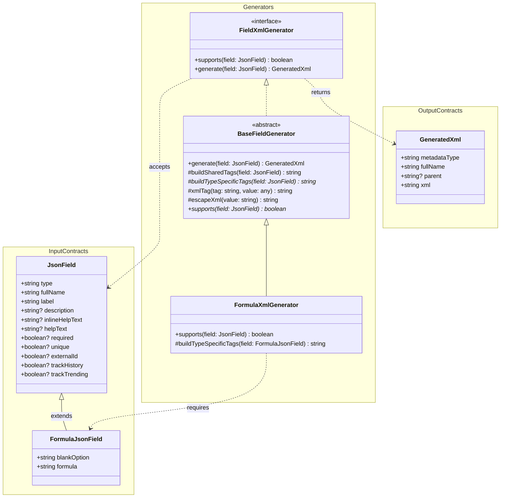

# XML Field Generator – Documentation

## Purpose

This module converts **JSON field definitions** into **Salesforce CustomField XML metadata**. It is designed to be **extensible**: each field type (Formula, Text, Number, etc.) has its own generator that plugs into a shared base class.

---

## High-level Flow

1. A field is defined as a JSON object (`JsonField` or a subtype).
2. A concrete `FieldXmlGenerator` checks if it supports the field.
3. The generator builds XML by:

   * rendering shared field tags (handled by the base class)
   * rendering type-specific tags (handled by the concrete class)
4. A `GeneratedXml` object is returned.
5. The XML string is written to disk.

---

## Core Interfaces

### `JsonField`

Represents the **common shape** of all field definitions.

* Contains properties shared by all Salesforce fields (name, label, tracking, etc.).
* Used as the base type for all field-specific interfaces.

### `FormulaJsonField`

Extends `JsonField` with **formula-only properties**.

* `formula`: the Salesforce formula expression.
* `blankOption`: how blanks are treated in the formula.

### `GeneratedXml`

Represents the **final output** of generation.

* `metadataType`: what kind of metadata this XML represents.
* `fullName`: API name of the field.
* `parent`: reserved for object-level grouping.
* `xml`: fully-formed XML string ready to write to disk.

### `FieldXmlGenerator`

Defines the contract for all generators.

* `supports(...)`: declares whether the generator can handle a field.
* `generate(...)`: produces `GeneratedXml`.

---

## `BaseFieldGenerator`
*See [xmlgenerators/BaseFieldGenerator](../src/run.ts) for detailed architecture.*

### Role

`BaseFieldGenerator` contains **all logic shared by every CustomField type**. Concrete generators extend this class and implement only what is field-type-specific.

### Responsibilities

* Enforces the generator contract (`FieldXmlGenerator`).
* Builds shared XML tags common to all fields.
* Wraps the XML in the `<CustomField>` root element.
* Escapes XML values safely.

### Key Methods

#### `buildSharedTags(field)`

Generates XML tags that apply to **all field types**, such as:

* `fullName`
* `label`
* `type`
* `description`
* `inlineHelpText`
* `externalId`
* `required`
* `trackHistory`
* `trackTrending`

Tags with `undefined` values are automatically omitted.

#### `buildTypeSpecificTags(field)`

Abstract method implemented by subclasses.

* Returns XML tags unique to the field type.

#### `generate(field)`

Coordinates XML creation:

1. Builds shared tags.
2. Appends type-specific tags.
3. Wraps everything in the Salesforce `<CustomField>` XML envelope.
4. Returns a `GeneratedXml` object.

#### `xmlTag(tag, value)`

Utility for safely generating XML tags.

* Skips undefined/null values.
* Escapes special XML characters.

#### `escapeXml(value)`

Ensures XML validity by escaping:

* `&`, `<`, `>`, `"`

---
## Type Specific Xml Generators

### `1. FormulaXmlGenerator`
*See [xmlgenerators/formula-field](../src/run.ts) for detailed architecture.*

#### Role

Generates XML specifically for **Salesforce Formula fields**.

#### How It Works

#### `supports(field)`

Determines eligibility.

* Returns `true` when `field.type` is `"formula"` (case-insensitive).

#### `buildTypeSpecificTags(field)`

Adds formula-specific XML tags:

* `formula`
* `formulaTreatBlanksAs`
* `unique`

These tags are appended after the shared tags produced by the base class.

---

## Class Diagram

